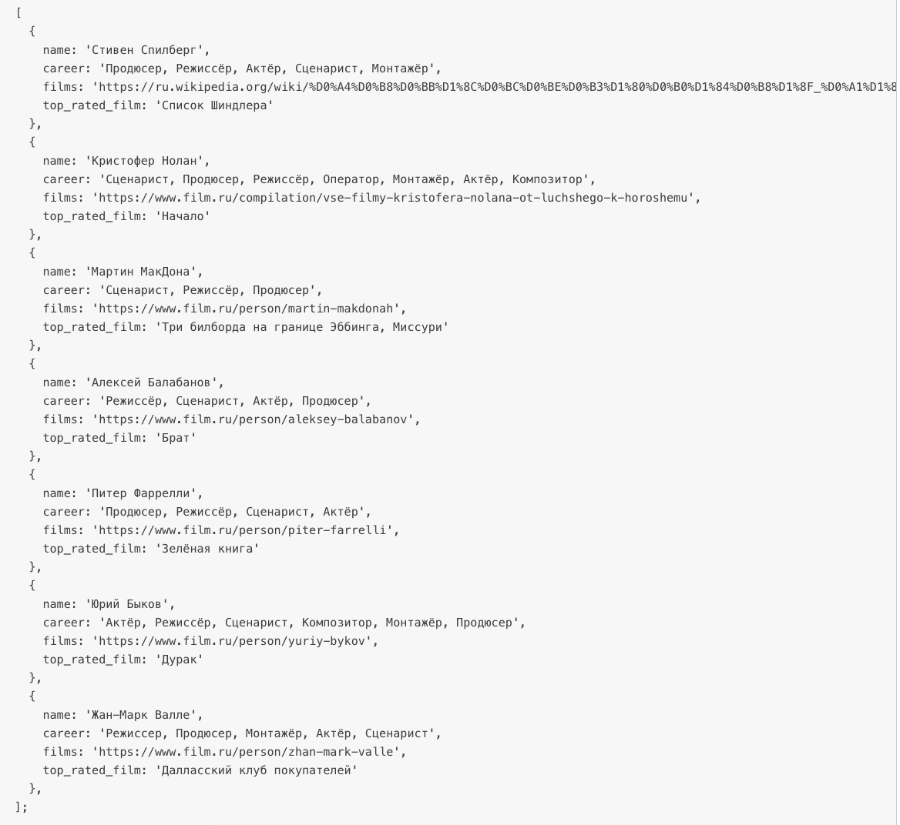

# Week_14_second_task

1  У вас есть массив с информацией о популярных режиссёрах. Отобразите информацию о каждом режиссёре на странице.

-Сохраните в переменную массив.

-Вызовите метод forEach у массива.

-В функцию обработчик добавьте код, который относится к работе с DOM

-В найденные элементы на странице добавьте информацию из каждого элемента массива.

2  Создайте новый массив topFilmsList, в нём должны быть лучшие фильмы режиссёров (они хранятся в полях top_rated_film).